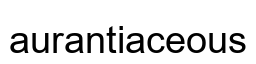
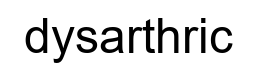
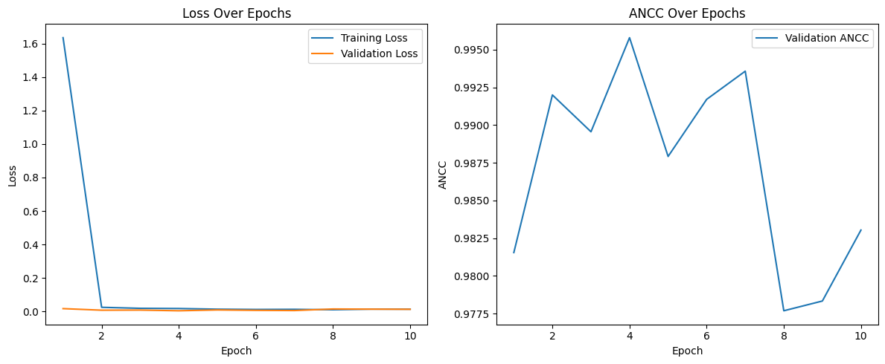
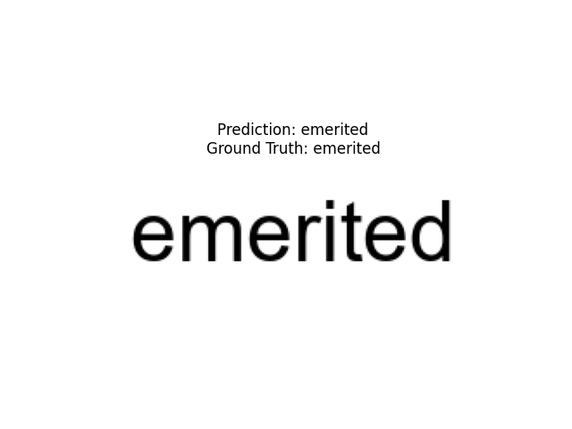
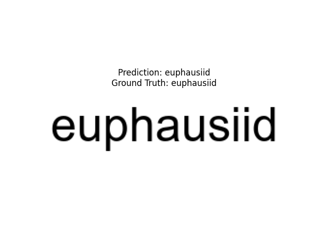
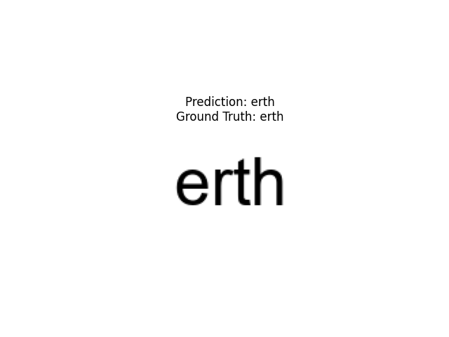
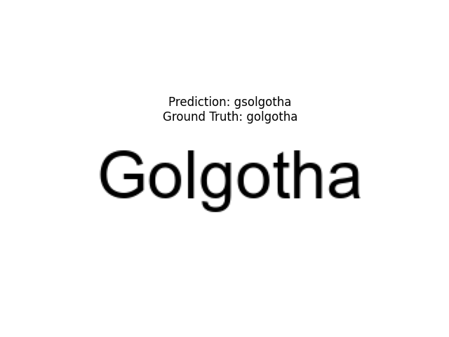
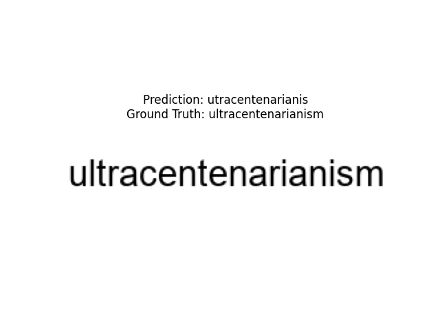
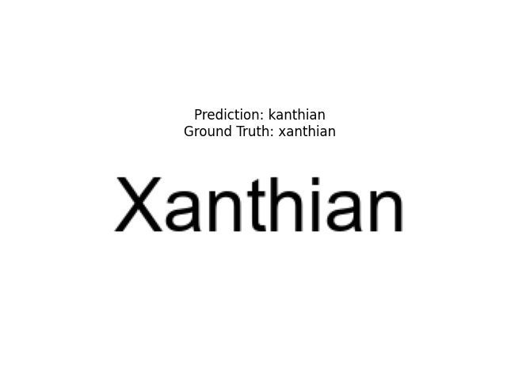
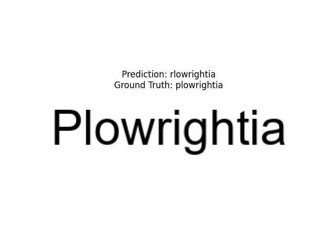

# SMAI Assignment 5

## Roll Number: 2022102018

## Table of Contents

- [KDE](#kde)
  - [Task 1: KDE Class](#task-1-kde-class)
  - [Task 2: Generate Synthetic Data](#task-2-generate-synthetic-data)
  - [Task 3: KDE vs GMM](#task-3-kde-vs-gmm)
- [HMMs](#hmms)
  - [Speech Digit Recognition](#speech-digit-recognition)
  - [Dataset](#dataset)
  - [Model Architecture](#model-architecture)
  - [Metrics](#metrics)
- [RNNs](#rnns)
  - [Counting Bits](#counting-bits)
  - [Optical Character Recognition](#optical-character-recognition)
- [References](#references)

---

## KDE

### Task 1: KDE Class
Implement a Kernel Density Estimation (KDE) class from scratch for `n`-dimensional data. This class should include:
- Hyperparameter selection for different kernels: box, Gaussian, and triangular.
- A `fit` method for fitting the KDE model to data.
- A `predict` method to return density estimates at specified points.
- A `visualize` method to plot densities against 2D data.

The `KDE` class performs Kernel Density Estimation (KDE) to estimate the probability density function of an unknown distribution based on sample data. This implementation offers three types of kernels (Gaussian, box, and triangular) and includes methods to fit data, predict density at specific points, and visualize the density for 2D data.

#### Initialization
The constructor initializes the `KDE` object with the specified kernel type, bandwidth, distance metric (though unused), and data.

```python
class KDE:
    def __init__(self, kernel, bandwidth, distance, data):
        self.kernel = kernel
        self.bandwidth = bandwidth
        self.distance = distance
        self.data = data
```

#### Kernel Functions
The KDE class provides three kernel functions for density estimation, each defining a different smoothing technique:

- **Gaussian Kernel**: Applies the Gaussian kernel function to estimate the density, using a bandwidth to control smoothing. This is effective for continuous data as it provides a smooth, bell-shaped curve around each data point.

- **Box Kernel**: A simple kernel that provides a constant density within a bandwidth window, creating a "box" around each data point.

- **Triangular Kernel**: Produces a linear decay from each data point to the edge of the bandwidth window. It’s useful for smoothing with a gradual decrease in influence further from the data point.

```python
    def gaussian_kernel(self, x, xi):
        return np.exp(-0.5 * ((x - xi) / self.bandwidth) ** 2) / (self.bandwidth * np.sqrt(2 * np.pi))

    def box_kernel(self, x, xi):
        return 0.5 * (np.abs(x - xi) <= self.bandwidth).astype(float) / self.bandwidth

    def triangular_kernel(self, x, xi):
        distance = np.abs(x - xi) / self.bandwidth
        return (1 - distance) * (distance <= 1)
```

#### Fit and Predict Methods

- **Fit Method**: Updates the KDE instance with new data, storing it as a NumPy array for fast computation.

- **Predict Method**: Computes the density estimate at a point `x` by applying the chosen kernel function to each point in the dataset. The final density estimate is an average over all kernel contributions, scaled by the number of points.

```python
    def fit(self, data):
        self.data = np.array(data)

    def predict(self, x):
        if self.kernel == 'gaussian':
            kernel_function = self.gaussian_kernel
        elif self.kernel == 'box':
            kernel_function = self.box_kernel
        elif self.kernel == 'triangle':
            kernel_function = self.triangular_kernel

        densities = [kernel_function(x, xi) for xi in self.data]
        return np.sum(densities) / len(self.data)
```

#### Visualization

- **Visualize Method**: Creates a density plot for 2D data using contour plots to display density levels. It computes densities over a grid of points using the `predict` function and overlays data points for reference. This method is particularly useful for visualizing density patterns in 2D data.

### Task 2: Generate Synthetic Data
Create synthetic data similar to the provided sample. The dataset includes:
- A larger, diffused circle of 3000 random samples.
- A smaller, dense circle with 500 samples.
- Ensure the generated data reflects overlapping density regions.

The `generate_diffuse_synthetic_data_with_boundary` function creates a synthetic dataset with two clusters to simulate regions of varying density and overlap, similar to the KDE example provided in the assignment. This dataset is intended to test the performance of density estimation and clustering algorithms like KDE and GMM.

#### Large, Diffuse Cluster
1. **Cluster Center**: The center of this large cluster is set at `[0, 0]`.
2. **Standard Deviation**: A higher standard deviation of `1.5` is used to create a more diffuse (spread-out) cluster of points.
3. **Making a loose boundary**: 
   - Points are initially generated around the center within the specified standard deviation.
   - I remove points whose distance from the center exceeds `2.75`. This boundary is applied to create a circular region around the origin.

#### Small, Dense Cluster
1. **Cluster Center**: Positioned at `[1, 1]`.
2. **Standard Deviation**: Use a smaller standard deviation of `0.25`, get a denser concentration of points.
3. **Number of Points**: Generates `500` points to create the localized dense region.

#### Combining Clusters
- The two clusters are combined into a single dataset using `np.vstack`, providing two distinct regions of density—one large and diffuse, the other small and dense. 

### The Dataset

- **Synthetic Dataset**  
  


### Task 3: Evaluation of KDE and GMM Models on Synthetic Dataset

For this task, we evaluate the performance and behavior of both Kernel Density Estimation (KDE) and Gaussian Mixture Model (GMM) on a synthetic dataset with overlapping clusters.

### KDE Model Analysis

The Kernel Density Estimation (KDE) model was used to estimate the density distribution in the dataset:
- **Smooth Density Estimation**: KDE provides a smooth estimation of the density distribution, effectively capturing the structure of the data. The smoothness is controlled by the kernel choice (Gaussian in this case) and the bandwidth parameter, which adjusts the level of smoothing.
- **Consistent Fit Across Complex Structures**: KDE does not rely on discrete clusters; it produces a continuous density estimate over the space, making it well-suited for data with overlapping or complex regions, as observed in this synthetic dataset. The KDE model consistently fits the data, capturing both the large, diffuse cluster and the smaller, denser cluster.
- **Bandwidth Sensitivity**: The bandwidth value influences KDE’s accuracy; a smaller bandwidth can reveal finer details, while a larger bandwidth can oversmooth the density. In this task, a bandwidth of 0.4 was chosen to balance detail and smoothness.

### KDE Model with Different Kernels

The following plots show the density estimation using the KDE model with different kernel functions.

- **Gaussian Kernel**  
  

- **Box Kernel**  
  

- **Triangle Kernel**  
  

### Analyzing KDE with Cross-Validation Loss

This implementation of Kernel Density Estimation (KDE) with cross-validation is designed to evaluate the performance of a KDE model across different kernels by using a leave-one-out log-likelihood score as the cross-validation metric. Here’s a detailed breakdown of the class structure and its functionality:

#### KDE Class
The `KDE` class implements a Kernel Density Estimation model with three kernel options: Gaussian, Box, and Triangular. It uses bandwidth as a smoothing parameter and can perform cross-validation to estimate the model's effectiveness.

1. **Initialization (`__init__` method)**
   - The constructor initializes the KDE with the selected kernel type, bandwidth, and data.
   - `self.kernel`: Specifies the type of kernel to use ('gaussian', 'box', or 'triangle').
   - `self.bandwidth`: Controls the degree of smoothing applied to the data.
   - `self.data`: Stores the dataset used for density estimation.

2. **Kernel Functions**
   - The class supports three different kernel functions:
     - **`gaussian_kernel`**: Applies a Gaussian kernel to calculate the density contribution from each data point, with decay determined by the bandwidth.
     - **`box_kernel`**: Applies a box (or rectangular) kernel, which considers only data points within a certain distance defined by the bandwidth.
     - **`triangular_kernel`**: Applies a triangular kernel, with weights linearly decreasing as the distance from the data point increases up to the bandwidth.

3. **Model Fitting (`fit` method)**
   - The `fit` method takes the input dataset and stores it for use in density estimation. This approach is non-parametric, so it retains all data points for density calculations.

4. **Density Prediction (`predict` method)**
   - For a given input point, `predict` calculates the density estimate by applying the selected kernel function to each point in `self.data` and summing the contributions.
   - This produces a density estimate for the point, based on how close it is to other data points and the chosen kernel.

5. **Visualization (`visualize` method)**
   - The `visualize` method creates a contour plot of the density estimates across a 2D grid, giving a graphical representation of the KDE.
   - It plots the KDE estimate using a grid of points covering the range of the dataset, and displays it alongside the original data points to show how well the KDE captures the data distribution.

6. **Cross-Validation (`cross_validate` method)**
   - This method performs cross-validation on the KDE model by computing the log-likelihood for each point, excluding itself from the density estimate. This technique is often called "leave-one-out" cross-validation.
   - **Steps in Cross-Validation**:
     - **Compute Pairwise Distances**: Calculates the squared Euclidean distances between all pairs of points, and then takes the square root to get distances.
     - **Kernel Application**:
       - For each point, apply the specified kernel function to the distance between this point and every other point in the dataset, excluding itself (to prevent bias).
       - Compute the density at each point as the sum of these kernel-applied values.
     - **Log-Likelihood Calculation**:
       - The log-likelihood of observing the data under the KDE model is calculated by summing the log of the leave-one-out densities for each point.
       - This log-likelihood serves as an evaluation metric to assess the performance of the KDE model. Higher values generally indicate a better fit to the data for the selected kernel and bandwidth.

#### Explanation of the Cross-Validation Loss
The cross-validation loss computed in `cross_validate` is based on the leave-one-out log-likelihood. This is effective for KDE models because it:
- Avoids overfitting by excluding each data point when estimating its density.
- Provides a measure of how well the KDE model generalizes to unseen data.

The `cross_validate` method can be used to tune the bandwidth parameter. A higher log-likelihood score indicates a better bandwidth setting, as it represents a KDE model that fits the data more accurately without overfitting.

### Cross-Validation Results for KDE Model

After evaluating different kernels and bandwidths using cross-validation, the results indicate that the **Gaussian kernel with a bandwidth of 0.1** provides the best performance based on the cross-validation log-likelihood score. Here is a summary of the scores for each configuration:

| Kernel    | Bandwidth | CV Log-Likelihood Score |
|-----------|-----------|-------------------------|
| Gaussian  | 0.1       | -8604.8499              |
| Gaussian  | 0.5       | -8893.7639              |
| Gaussian  | 1.0       | -9523.3678              |
| Gaussian  | 2.0       | -11069.3330             |
| Box       | 0.1       | -12049.7087             |
| Box       | 0.5       | -9353.2084              |
| Box       | 1.0       | -9710.9777              |
| Box       | 2.0       | -10367.5729             |
| Triangle  | 0.1       | `nan`                   |
| Triangle  | 0.5       | `nan`                   |
| Triangle  | 1.0       | `nan`                   |
| Triangle  | 2.0       | `nan`                   |

### Interpretation

- **Best Model**: The Gaussian kernel with a bandwidth of 0.1 achieved the highest log-likelihood score of **-8604.8499**, indicating that this configuration best captures the data distribution without overfitting.

### Conclusion

Based on the cross-validation results, the optimal KDE configuration is:
- **Kernel**: Gaussian
- **Bandwidth**: 0.1
- **Cross-Validation Log-Likelihood Score**: -8604.8499

This configuration offers the best trade-off between bias and variance, effectively capturing the data distribution with minimal cross-validation loss.


### GMM Model Analysis with Varying Cluster Components

The Gaussian Mixture Model (GMM) was applied to the dataset, starting with 2 clusters and increasing up to 10 clusters. 

- **GMM with 2 Components**  
  

- **GMM with 3 Components**  
  

- **GMM with 4 Components**  
  

- **GMM with 5 Components**  
  

The observations are as follows:

1. **Two-Component GMM**:
   - With two components, GMM identifies the two primary regions: the large, diffuse cluster and the smaller, dense cluster.
   - This configuration captures the overall structure, but lacks finer granularity within the large cluster. The resulting clustering shows GMM’s ability to separate the two main regions but with limited detail in the larger cluster.

2. **Increasing Number of Components**:
   - As the number of components increases, GMM starts capturing more internal structures within the large cluster, dividing it into multiple sub-clusters.
   - For example, with 3–5 components, the model begins to uncover subregions within the large cluster, while still isolating the smaller cluster. Each additional component improves fit in denser areas of the data.
   - However, as the component count becomes too high (e.g., 9 or 10), the model may **overfit**, identifying clusters in areas without meaningful patterns, effectively fitting noise.

3. **Optimal Cluster Selection with BIC and AIC**:
   - Based on Bayesian Information Criterion (BIC) and Akaike Information Criterion (AIC) scores, the optimal number of clusters is as follows:
     - **BIC** suggests an optimal count of **4 clusters**, providing a balance between model complexity and data fit without overfitting.
     - **AIC**, being less restrictive, suggests **10 clusters** as optimal, reflecting an incremental improvement with additional components but at the risk of excessive complexity.
   - The BIC and AIC score plots show this trade-off: BIC reaches a minimum around 4 clusters, while AIC gradually decreases with more clusters, indicating that more components continue to improve the fit, albeit with diminishing returns.

### Optimal Number of Clusters (BIC and AIC Scores)

The BIC and AIC score plot helps determine the optimal number of clusters for the GMM model by balancing data fit with model complexity.

- **Optimal number of clusters by BIC**: 4  (BIC: 17444.8579)
- **Optimal number of clusters by AIC**: 10 (AIC: 17141.2956)

#### AIC Scores Across Cluster Counts

| Clusters | AIC              |
|----------|-------------------|
| 1        | 18345.72         |
| 2        | 17452.23         |
| 3        | 17371.61         |
| 4        | 17307.21         |
| 5        | 17276.85         |
| 6        | 17237.89         |
| 7        | 17250.74         |
| 8        | 17186.08         |
| 9        | 17188.38         |
| 10       | 17141.30         |

#### BIC Scores Across Cluster Counts

| Clusters | BIC              |
|----------|-------------------|
| 1        | 18375.64         |
| 2        | 17518.06         |
| 3        | 17473.35         |
| 4        | 17444.86         |
| 5        | 17450.41         |
| 6        | 17447.36         |
| 7        | 17496.12         |
| 8        | 17467.36         |
| 9        | 17505.57         |
| 10       | 17494.40         |


From the tables above, we observe that:
- The AIC score reaches its minimum at 10 clusters, suggesting that this is the optimal number based on AIC.
- The BIC score is lowest for 4 clusters, indicating a simpler model with fewer clusters might be preferable based on BIC.

- **BIC and AIC Score Plot**  
  

#### Comparison and Conclusion

- **KDE** provides a stable and consistent fit for the dataset, capturing continuous density variations without assuming discrete clusters. This is advantageous for datasets with overlapping densities or complex structures.
- **GMM** allows for detecting discrete subregions by using multiple components. However, as more components are added, the risk of overfitting increases, as reflected by BIC’s slight rise beyond 4 clusters.
- **Model Selection**: For cases requiring distinct clustering, GMM with around 4 clusters (based on BIC) offers a reasonable balance. For more detailed density estimation, KDE is robust as it doesn’t assume strict clusters, making it suitable for complex, overlapping density regions.

In summary, **KDE consistently fits the continuous density landscape**, while **GMM adapts to the dataset’s clustering structure, with optimal performance at 4 clusters** to balance underfitting and overfitting.

## HMMs

This Hidden Markov Model (HMM) part involves training and evaluating a model for recognizing spoken digits (0-9) based on Mel-frequency cepstral coefficients (MFCCs) extracted from audio recordings. Here's a detailed breakdown of the approach:

### Dataset
---

#### 1. Data Preparation and Preprocessing
   - **Audio File Loading**: Audio files in `.wav` format are loaded from the specified directory, each file representing a spoken digit. Files are categorized by digits (0-9), so each digit has its list of associated files.
   - **MFCC Extraction**: For each audio file, MFCCs are extracted using `librosa`. MFCCs are commonly used in audio processing as they capture spectral features that are effective for speech recognition.
   - **Data Structure**: The MFCCs are organized into dictionaries, where each key (digit) contains a list of MFCC arrays, each array representing an instance of that digit.

#### 2. Visualization
   - **MFCC Heatmaps**: For a sample of each digit, the MFCCs are visualized as heatmaps. Each heatmap shows the MFCC coefficients over time, providing insight into the characteristics of each digit's sound profile.


The following heatmaps show the MFCC features over time for each digit (0-9). Each plot provides a visual representation of how the spectral features vary as the digit is pronounced.

| Digit | MFCC Heatmap |
|-------|--------------|
| **0** |  |
| **1** |  |
| **2** |  |
| **3** |  |
| **4** |  |
| **5** |  |
| **6** |  |
| **7** |  |
| **8** |  |
| **9** |  |

Each row in the heatmap represents one of the 13 MFCC coefficients, and each column represents a time step. The color intensity indicates the magnitude of each coefficient, giving insight into the unique spectral characteristics of each digit.

#### Why HMM?
#### 1. Temporal Dynamics
   - Speech signals are inherently sequential, and different sounds (phonemes) unfold over time.
   - MFCCs provide a time-series representation of the speech signal.
   - HMMs are well-suited for time-dependent data as they can model sequences where each state represents a distinct part of the audio (e.g., a phoneme or a segment of a digit).

#### 2. Variability in Pronunciation
   - There is often variability in how each digit is pronounced by different speakers or even by the same speaker at different times.
   - HMMs handle this variability by probabilistically modeling transitions between states, allowing flexibility in capturing different pronunciations of each digit.

#### 3. State Representation of Sound Units
   - HMMs can represent different sound units (e.g., the beginning, middle, and end of a digit) as states.
   - Each state corresponds to a unique spectral pattern in the MFCC, helping the model recognize the digit by learning the sequence of MFCC patterns.

#### 4. Adaptability to Changes in Signal Patterns
   - The MFCCs for each digit show varying intensities and frequency distributions over time, indicating transitions between different sounds within each digit.
   - HMMs handle these transitions well because they are designed to model state changes over time, making them capable of distinguishing these patterns effectively.

### Train-Test Split
   - The dataset is split into training and testing sets for each digit (80% training, 20% testing). This split allows us to evaluate the model's performance on unseen data, helping avoid overfitting.

### Model Architecture 

#### 1. Model Arcitecture and Training
   - **HMM Initialization**: Each digit is represented by a separate Hidden Markov Model (HMM). For each digit, an HMM is initialized with a specific number of states (`fixed n_components=9`). This number controls the complexity of the model, balancing detail with generalization.
   - **Model Fitting**: For each digit, the HMM is trained on the MFCC data for that digit. The training data is concatenated for each digit, and the lengths of the sequences are noted. The model learns patterns unique to each digit through the HMM's hidden states, effectively modeling the progression of MFCC features over time.

#### 2. Prediction and Testing
   - **Prediction Function**: Given MFCC features of a test sample, the `predict_digit` function calculates the likelihood score for each digit model. The digit model with the highest score is chosen as the predicted digit.
   - **Accuracy Calculation**: The model is evaluated on the test set, recording overall and per-digit accuracy. The correct and total predictions for each digit are stored, providing a breakdown of performance by digit.

### 1. Gaussian HMM Results

Overall accuracy on the test set: 94.17%


| Digit | Test Accuracy (%) | Personal Accuracy (%) |
|-------|--------------------|-----------------------|
| 0     | 98.33             | 100.0                |
| 1     | 93.33             | 0.0                  |
| 2     | 93.33             | 100.0                |
| 3     | 85.0              | 0.0                  |
| 4     | 100.0             | 0.0                  |
| 5     | 95.0              | 100.0                |
| 6     | 85.0              | 0.0                  |
| 7     | 95.0              | 0.0                  |
| 8     | 96.67             | 0.0                  |
| 9     | 96.67             | 0.0                  |


Overall accuracy on personal recordings: 30.00%
### 2. GMM-HMM Results
Overall accuracy on the test set: 97.50%


| Digit | Test Accuracy (%) | Personal Accuracy (%) |
|-------|--------------------|-----------------------|
| 0     | 93.33             | 0.0                  |
| 1     | 96.67             | 0.0                  |
| 2     | 98.33             | 0.0                  |
| 3     | 95.0              | 0.0                  |
| 4     | 100.0             | 100.0                |
| 5     | 98.33             | 0.0                  |
| 6     | 96.67             | 0.0                  |
| 7     | 98.33             | 0.0                  |
| 8     | 100.0             | 0.0                  |
| 9     | 98.33             | 0.0                  |


Overall accuracy on personal recordings: 10.00%

### 3. Interpretation of Results
- Clearly, the GMM-HMM worked better for the given test data, however it was horrible for my own personal recordings. 
- **Overall Performance**: The overall accuracy on both test and personal datasets indicates the effectiveness of the model. High test accuracy with lower personal recording accuracy could suggest the model is overfitted to the training data.

## RNNs

### 4.1 Counting Bits

In this task, we trained a character-level RNN to count the number of '1' bits in a binary sequence.

---

### 4.1.1 Task 1: Dataset

- **Dataset Creation**: A dataset of 100,000 binary sequences was generated, with sequence lengths varying from 1 to 16. Each sequence is paired with a label indicating the count of `1`s in that sequence.
- **Examples**:
    ```
    Sequence: [0, 0, 1, 0, 1, 0, 0, 0, 0, 0, 0, 1, 1, 0], Count of 1s: 4
    Sequence: [1, 0, 0, 1, 1, 0], Count of 1s: 3
    Sequence: [0, 0, 1, 1, 1], Count of 1s: 3
    Sequence: [1, 0, 1, 0, 0, 0, 1, 1, 0, 1], Count of 1s: 5
    Sequence: [1, 0, 1, 1, 0, 1, 0, 1, 0, 1, 1, 0, 0], Count of 1s: 7
    ```
- **Dataset Split**: The dataset was split into training, validation, and test sets with ratios of 80%, 10%, and 10%, respectively.
    ```
    Training set: 80,000 sequences
    Validation set: 10,000 sequences
    Test set: 10,000 sequences
    ```

### 4.1.2 Task 2: Architecture

- **Model**: The model is a character-level RNN that reads each bit in the sequence and learns to accumulate the count of `1`s.
    - **Input Encoding**: Each bit is represented as a two-dimensional vector: `[1, 0]` for `0` and `[0, 1]` for `1`.
    - **Layers**: The RNN model consists of a recurrent layer (`nn.RNN`) followed by an optional layer normalization (`nn.LayerNorm`) and a fully connected layer.
    - **Hyperparameters**: 
        - Hidden sizes experimented: `[16, 32]`
        - Number of layers: `[1, 2]`
        - Dropout rates: `[0.0, 0.25]`
        - Layer normalization: `[True, False]`
    - **Objective**: The final RNN output at the last time step is used to predict the count of `1`s in the sequence.

### 4.1.3 Task 3: Training

- **Training Process**: The model was trained using Mean Absolute Error (MAE) as the loss function. The training was performed on a GPU for 5 epochs with early stopping based on validation performance.
    - **Optimizer**: Adam optimizer with a learning rate of `0.001`.
    - **Epoch Outputs**:
        ```
        Epoch [1/5], Train MAE: 1.3070, Val MAE: 0.1885
        Epoch [2/5], Train MAE: 0.1269, Val MAE: 0.0736
        Epoch [3/5], Train MAE: 0.0724, Val MAE: 0.0954
        Epoch [4/5], Train MAE: 0.0632, Val MAE: 0.0352
        Epoch [5/5], Train MAE: 0.0629, Val MAE: 0.0352
        ```

- **Hyperparameter Tuning**: The model was tuned with various configurations to find the best parameters, resulting in the optimal model achieving a validation MAE of `0.1291`.

- **Random Baseline Comparison**: A random baseline was also tested by randomly predicting the count of `1`s within the sequence length range. This baseline yielded an MAE of `2.5764`, demonstrating the RNN model's superior performance.

### Task 4: Generalization

- **Out-of-Distribution Testing**: To evaluate generalization, the model was tested on sequences longer than the training set, specifically from lengths 17 to 32. For each length, MAE was computed.
    - **MAE Trend**: The MAE initially increases as the sequence length grows, peaking around length 12–14, and then decreases, suggesting the model adapts to longer sequences after a certain length.

- **Plot**:
    - The following plot illustrates the model's MAE across sequence lengths from 1 to 32:
    - 

---

### Summary of Best Model Configuration

The best-performing model configuration was as follows:
- **Hidden Size**: 16
- **Number of Layers**: 1
- **Dropout**: 0.0
- **Layer Normalization**: False

With these settings, the model achieved a **Validation MAE** of `0.1291`, significantly better than the random baseline.

This structured RNN approach to bit counting demonstrates that the model is capable of generalizing beyond the training distribution, as evidenced by the generalization evaluation and the consistent reduction in error at longer sequence lengths.

### 4.2 Optical Character Recognition

#### 4.2.1 Task 1: Dataset
In this task, a dataset of 100,000 words is created from the `nltk.corpus.words` library. Each word is rendered as a 256x64 grayscale image, with the word centered on a plain white background. The images are saved with unique filenames based on the word and index. This dataset of image-word pairs serves as input for the OCR model, allowing it to learn mappings from visual character sequences to textual representations. The process involves:
- **Image Rendering**: Each word is rendered using a specified font size, adjusting dynamically to fit within the image width.
- **Sample Display**: A few randomly selected images are displayed to verify correct rendering.

| Image                          | Word             |
|--------------------------------|------------------|
|  | aurantiaceous |
|        | dysarthric    |
|          | hunkerous     |
|              | kipskin       |
|                | reswim        |

#### 4.2.2 Task 2: Architecture
The model follows an encoder-decoder architecture:
- **Encoder**: A Convolutional Neural Network (CNN) that extracts spatial features from each image, capturing visual patterns corresponding to characters.
    - Two convolutional layers with batch normalization, ReLU activation, and max pooling to progressively reduce spatial dimensions while increasing feature depth.
- **Decoder**: A Recurrent Neural Network (RNN) that processes the extracted features sequentially, predicting characters in order.
    - A bidirectional LSTM layer processes the sequence of CNN outputs, learning dependencies across time.
    - A fully connected layer and LogSoftmax activation produce character probabilities for each time step.
    - The CRNN model outputs character predictions as a sequence, reconstructing the word.

#### 4.2.3 Task 3: Training
The training process uses a basic loop with validation after each epoch. The main elements are:
- **Loss Function**: Connectionist Temporal Classification (CTC) loss to handle variable-length output sequences. The loss aligns the predicted sequences with ground truth labels, accounting for potential gaps and repeated predictions.
- **Metrics**: Average Number of Correct Characters (ANCC) to evaluate the model's character-level accuracy, comparing predicted characters against ground truth. A random baseline is also computed by generating random sequences for each word length.
- **Training and Validation Results**:
    - Training loss and validation loss are tracked over epochs, along with ANCC.
    - Example training output:
    ```
    Starting training...
    Epoch 10:   0%|          | 2/1250 [00:00<03:54,  5.33batch/s, loss=0.0158] 
    Epoch 10 [0/80000] Loss: 0.0036

    Epoch 10:   8%|▊         | 102/1250 [00:15<02:47,  6.84batch/s, loss=0.00165]
    Epoch 10 [6400/80000] Loss: 0.0056

    Epoch 10:  16%|█▌        | 202/1250 [00:30<02:39,  6.56batch/s, loss=0.0216]  
    Epoch 10 [12800/80000] Loss: 0.0012

    Epoch 10:  24%|██▍       | 302/1250 [00:45<02:15,  6.98batch/s, loss=0.0152] 
    Epoch 10 [19200/80000] Loss: 0.0064

    Epoch 10:  32%|███▏      | 402/1250 [00:59<02:03,  6.87batch/s, loss=0.00138] 
    Epoch 10 [25600/80000] Loss: 0.0008

    Epoch 10:  40%|████      | 502/1250 [01:14<01:50,  6.79batch/s, loss=0.00523] 
    Epoch 10 [32000/80000] Loss: 0.0003

    Epoch 10:  48%|████▊     | 602/1250 [01:29<01:36,  6.70batch/s, loss=0.000356]
    Epoch 10 [38400/80000] Loss: 0.0241

    Epoch 10:  56%|█████▌    | 702/1250 [01:44<01:16,  7.17batch/s, loss=0.00208] 
    Epoch 10 [44800/80000] Loss: 0.0057

    Epoch 10:  64%|██████▍   | 802/1250 [01:58<01:02,  7.20batch/s, loss=0.0536]  
    Epoch 10 [51200/80000] Loss: 0.0395

    Epoch 10:  72%|███████▏  | 902/1250 [02:11<00:48,  7.24batch/s, loss=0.00235]
    Epoch 10 [57600/80000] Loss: 0.0050

    Epoch 10:  80%|████████  | 1002/1250 [02:25<00:33,  7.32batch/s, loss=0.0244] 
    Epoch 10 [64000/80000] Loss: 0.0077

    Epoch 10:  88%|████████▊ | 1102/1250 [02:39<00:20,  7.29batch/s, loss=0.00888]
    Epoch 10 [70400/80000] Loss: 0.0158

    Epoch 10:  96%|█████████▌| 1202/1250 [02:53<00:06,  7.40batch/s, loss=0.0215] 
    Epoch 10 [76800/80000] Loss: 0.0071

    Epoch 10: 100%|██████████| 1250/1250 [02:59<00:00,  6.96batch/s, loss=0.00912]
    Epoch 10 Training Loss: 0.0127

    Validation: 100%|██████████| 157/157 [00:14<00:00, 10.59batch/s, loss=0.00715]
        
    Validation Loss: 0.0120
    Average Number of Correct Characters: 0.9830
    Best Val Loss is 0.0031037973753505854
    ```

**Train Losses**: `[1.636, 0.023, 0.017, 0.016, 0.012, 0.010, 0.011, 0.009, 0.013, 0.012]`  
**Validation Losses**: `[0.015, 0.006, 0.007, 0.003, 0.008, 0.005, 0.004, 0.013, 0.012, 0.012]`  
**Validation ANCCs**: `[0.9815, 0.9919, 0.9895, 0.9957, 0.9879, 0.9917, 0.9935, 0.9776, 0.9783, 0.9830]`


The final model achieved an **Average Number of Correct Characters (ANCC)** of **0.9830** on the validation set, showing high accuracy in character prediction.

#### 4.2.4 Task 4: Generalization and Evaluation
The model's generalization capability is tested using out-of-sample data. During evaluation, predictions and ground truth words are compared to identify matches and mismatches.

- **Correct Predictions**: Examples where the model correctly predicted the word.
- **Mismatched Predictions**: Cases where the model’s prediction differs from the ground truth.

**Examples of Mismatched Predictions**:
- Prediction: `gsolgotha` | Ground Truth: `golgotha`
- Prediction: `utracentenarianis` | Ground Truth: `ultracentenarianism`
- Prediction: `kanthian` | Ground Truth: `xanthian`
- Prediction: `rlowrightia` | Ground Truth: `plowrightia`

This analysis of mismatches helps in identifying potential limitations of the model, such as difficulty in predicting rare or complex words.

#### 4.2.5 Visualization
1. **Loss and ANCC Plots**: Training and validation loss, along with ANCC, are visualized across epochs in the plot below.

    

2. **Sample Predictions**: Sample predictions, both correct and incorrect, are saved in the `predictions` and `mismatches` directories respectively, with mismatches providing valuable information for further model tuning.

    - **Correct Matches**
        - 
        - 
        - 
        - 

    - **Mismatches**:
        - 
        - 
        - 
        - 

Overall, this model architecture and training approach highlight the potential of combining CNNs and RNNs for OCR tasks, achieving high character accuracy on the validation set.

---

## References
- **Video Tutorials**: 
  - [Kernel Density Estimation](https://www.youtube.com/watch?v=t1PEhjyzxLA)
  - [`librosa` for MFCC extraction](https://librosa.org/doc/latest/index.html)
  - [`hmmlearn` for HMM implementation](https://hmmlearn.readthedocs.io/en/latest/)
  - [Stanford Paper on HMM and Markov Models](https://web.stanford.edu/~jurafsky/slp3/A.pdf)
  - [`nltk` for word dataset](https://www.nltk.org/)
