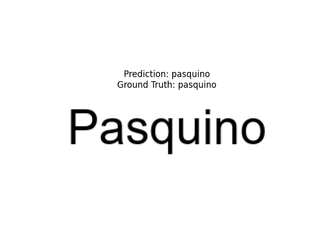

## OCR: Optical Character Recognition with CNN-RNN-Attention

This section presents a custom OCR system that leverages deep learning—specifically, CNNs for feature extraction and RNNs for sequence modeling, enhanced with attention mechanisms—to accurately predict text from rendered word images.

### Table of Contents
- [Task 1: Dataset Creation](#421-task-1-dataset)
- [Task 2: Model Architecture](#422-task-2-architecture)
- [Task 3: Training](#423-task-3-training)
- [Task 4: Generalization and Evaluation](#424-task-4-generalization-and-evaluation)
- [Task 5: Visualization](#425-visualization)

---

### 4.2.1 Task 1: Dataset

A custom dataset of **100,000 words** is created using `nltk.corpus.words`. Each word is rendered as a **256x64 grayscale image**, centered on a plain white background.

- **Rendering Pipeline**:
  - Dynamic font size ensures the word fits within image width.
  - Unique filenames (`index_word.png`) are generated for traceability.
  - A few randomly chosen images are displayed for verification.

| Image | Word |
|-------|------|
|  | aurantiaceous |
|        | dysarthric    |
|          | hunkerous     |
|              | kipskin       |
|                | reswim        |

---

### 4.2.2 Task 2: Architecture

The OCR model adopts an **encoder-decoder architecture**:

#### Encoder (CNN)
- Two convolutional layers
- Batch normalization + ReLU
- Max pooling for downsampling
- Extracts robust visual features from the word image.

#### Decoder (RNN)
- **Bidirectional LSTM** to capture forward and backward dependencies in the sequence.
- **Fully Connected Layer + LogSoftmax** for character probability prediction.
- Final model outputs a character sequence using **CTC decoding**.

---

### 4.2.3 Task 3: Training

- **Loss Function**: CTC Loss (Connectionist Temporal Classification) aligns predictions with variable-length ground truths.
- **Metric**: *Average Number of Correct Characters (ANCC)*—compares predicted vs ground-truth characters.
- A random baseline is computed for comparison.

#### Example Training Logs (Epoch 10)
```
Epoch 10: 0%|          | 2/1250 [00:00<03:54,  5.33batch/s, loss=0.0158] 
Epoch 10 [0/80000] Loss: 0.0036
...
Epoch 10: 100%|██████████| 1250/1250 [02:59<00:00,  6.96batch/s, loss=0.00912]
Epoch 10 Training Loss: 0.0127
Validation Loss: 0.0120
Average Number of Correct Characters: 0.9830
```

#### Results Summary
- **Train Losses**: [1.636, 0.023, 0.017, 0.016, 0.012, 0.010, 0.011, 0.009, 0.013, 0.012]  
- **Val Losses**: [0.015, 0.006, 0.007, 0.003, 0.008, 0.005, 0.004, 0.013, 0.012, 0.012]  
- **Validation ANCCs**: [0.9815, 0.9919, 0.9895, 0.9957, 0.9879, 0.9917, 0.9935, 0.9776, 0.9783, 0.9830]

The final model achieves **0.9830 ANCC**, showing strong character-level accuracy.

---

### 4.2.4 Task 4: Generalization and Evaluation

To test generalization, the model is evaluated on **out-of-sample** data.

#### ✔️ Correct Predictions
Cases where the predicted word matches the ground truth.

#### ❌ Mismatched Predictions
| Prediction          | Ground Truth         |
|---------------------|----------------------|
| gsolgotha           | golgotha             |
| utracentenarianis   | ultracentenarianism |
| kanthian            | xanthian            |
| rlowrightia         | plowrightia         |

Such mismatches highlight limitations with rare or visually ambiguous words.

---

### 4.2.5 Visualization

#### Loss & Accuracy Plot
A combined plot of training/validation loss and ANCC over epochs.


#### Sample Predictions

**Correct Predictions**
- 
- 
- 
- 

**Mismatched Predictions**
- 
- 
- 
- 

---

### References
- [NLTK Word Dataset](https://www.nltk.org/)
